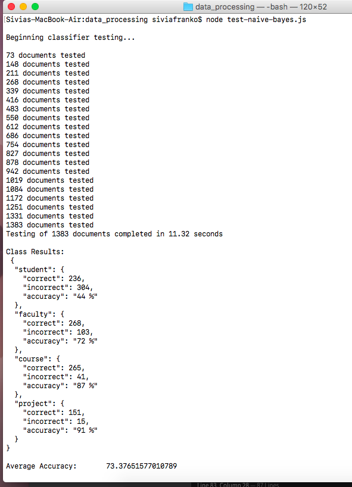

# Text Search & Classification with Natural


-----


## Overview

#### [What is Natural](#natural-overview)

#### [Installation](#installing-node-and-natural)

#### [TF-IDF Calculation](#tf-idf)

#### [Cosine Similarity Calculation](#cosine-similarity)

#### [Text Classification](#naive-bayes-classification)

#### [Demo](#natural-demo)

#### [Running Demo Locally](#run-demo-locally)


-----


## Natural Overview

[Natural] is one of the more popular natural language processing libraries for Node.js. It's receiving approximately 50,000 downloads per week at the time of this documentation.

Some utilities provided by Natural include:
- tokenizing
- stemming
- string distance
- tf-idf
- classification
- WordNet integration
- spell checking
- inflectors
- n-grams

Natural strives to provide a one stop NLP resource for JavaScript, similar to NLTK for Python. They need contributors! If you are interested in NLP and JavaScript/Node.js, then this appears to be great opportunity to contribute to open source NLP.


## Installing Node and Natural

This section contains a quick overview and installation instructions to get up and running with Node.js and NLP package Natural.


### Node.js

Node.js is a JavaScript runtime environment that utilizes Google's V8 JavaScript engine to execute JavaScript outside the browser.

Running JavaScript outside the browser with Node.js allows JavaScript to run on the server.

[More About Node.js]

[Install Node.js]

After installing Node.js, confirm that installation was successful by opening the terminal checking the current version. Version 9 was just released in October.
```
$ node -v
v9.1.0  
```


### NPM

The Node Package Manager (NPM) is installed with Node.js as the default package manager for Node.js. Alternative package managers are available for download.

Confirm that NPM is available by opening the terminal and checking the current version.
```
$ npm -v
5.5.1
```

[More About NPM]


### Natural Package

Natural is easily installed with NPM. From your project directory, simply execute:
```
npm install --save natural
```

The next section will cover creating a project with Natural from scratch.


### Starting a Project With Natural

1. Create a new directory for your project, then navigate to project directory.
```
$ mkdir NaturalDemo
$ cd NaturalDemo
```
2. Create a package.json file. The package.json file is a config file to organize project dependencies.
```
$ npm init
```
This command will prompt for several project attributes. Complete the prompts or press enter to use default/blank values.
3. Install Natural and save it to the package.json file.
```
$ npm install --save natural
```
4. Import the natural library to your code by including it at the top of your js file.
```javascript
const natural = require('natural');
```

That's it! The Natural API is now available for use in your JavaScript project.

[Check Out Natural Documentation] to learn more about using Natural in your projects.


-----


## TF IDF

This section walks through the construction of a word-doc tf-idf matrix given a collection of documents.

### Tokenizing

The first step in calculating tf-idf values is the tokenization of documents.

Natural currently supports 4 tokenizers
1. Word Tokenizer
2. Treebank Tokenizer
3. Word/Punctuation Tokenizer
4. Regular Expresson Tokenizer

#### Tokenize Example

[tokenize.js]
```javascript
const natural = require('natural');
const tokenizer = new natural.WordTokenizer();

const document = "This is an example document, let's see it tokenized";

const tokenizedDocument = tokenizer.tokenize(document);

console.log(tokenizedDocument);
```

Output
```
$ node tokenize.js
[ 'This',
  'is',
  'an',
  'example',
  'document',
  'let',
  's',
  'see',
  'it',
  'tokenized' ]
```

### Stemming

Next we apply stemming to all of the document terms.

Natural provides Porter and Lancaster Stemming algorithms.

#### Stemming Example

[stemming.js]
```javascript
const natural = require('natural');
const tokenizer = new natural.WordTokenizer();

const document = "This is an example document, let's see it tokenized";

const tokenizedStemmedDocument = tokenizer
  .tokenize(document)
  .map(term => natural.PorterStemmer.stem(term));

console.log(tokenizedStemmedDocument);
```

Output
```
$ node stemming.js
[ 'thi',
  'is',
  'an',
  'exampl',
  'document',
  'let',
  's',
  'see',
  'it',
  'token' ]
```

### TF-IDF Calculation

Natural offers several options for computing tf-idf values for each document-term pair.

1. Supply documents to TfIdf object as relative file path.
2. Supply documents to TfIdf object as an un-tokenized string.
3. Supply documents to TfIdf object as an array of tokens.

Options 1 and 2 will use Natural's default tokenization techniques. In our example below, we will use option 3 so that we can apply stemming to our tokens.


#### TF-IDF Example

[tf-idf.js]
```javascript
var natural = require('natural');
const tokenizer = new natural.WordTokenizer();
const tfidf = new natural.TfIdf();


const document1 = "cats and dogs are popular pets";
const document2 = "cats like to sleep a lot";
const document3 = "dogs like to play outside with other dogs"
const document4 = "fish are not much fun";

const collection = [document1, document2, document3, document4];

const tokenizedStemmedDocuments = [];

// Push tokenized/stemmed docs onto new array
collection.forEach(doc => {
  tokenizedStemmedDocuments.push(
    tokenizer.tokenize(doc)
    .map(term => natural.PorterStemmer.stem(term)));
});

// Add each tokenized/stemmed doc to tfidf object
tokenizedStemmedDocuments.forEach(doc => tfidf.addDocument(doc));

// Output each documents tf-idf values
collection.forEach((doc, idx) => {
  console.log('\nDocument ' + idx);
  tfidf.listTerms(idx).forEach(item => {
    console.log(item.term + ': ' + item.tfidf.toFixed(3));
  });
})
```

Output
```
$ node tf-idf.js

Document 0
ar: 1.693
popular: 1.693
pet: 1.693
cat: 1.288
dog: 1.288
and: 0.777

Document 1
sleep: 1.693
eat: 1.693
a: 1.693
lot: 1.693
cat: 1.288
like: 1.288
to: 1.288
and: 0.777

Document 2
dog: 2.575
plai: 1.693
outsid: 1.693
be: 1.693
with: 1.693
other: 1.693
like: 1.288
to: 1.288
and: 0.777

Document 3
fish: 1.693
swim: 1.693
in: 1.693
circl: 1.693
blow: 1.693
bubbl: 1.693
and: 0.777
```

Document 2 has a higher tf-idf for term 'dog' because frequency of dog is higher than other terms.

All documents have a low tf-idf score for term 'and' because the document frequency is 4, this term is not rare, resulting in a small idf value.


-----


## Cosine Similarity

The Natural library does not provide cosine similarity functionality.

I've defined my own module for calculating Cosine Similarity. Find [cosine similarity source] code here

#### Cosine Similarity Example

This example calculates the cosine similarity for all document pairs and outputs as a matrix.

[cosine-similarity.js]
```javascript
const natural = require('natural');
const tokenizer = new natural.WordTokenizer();
const tfidf = new natural.TfIdf();
const CosineSimilarity = require('../modules/cosine-similarity/main');
const calcCosineSimilarity = CosineSimilarity.cosineSimilarity;

const document1 = "cats and dogs are popular pets";
const document2 = "cats like to sleep and eat a lot";
const document3 = "dogs like to play outside and be with other dogs"
const document4 = "fish swim in circles and blow bubbles";

const collection = [document1, document2, document3, document4];

const tokenizedStemmedDocuments = [];

// Push tokenized/stemmed docs onto new array
collection.forEach(doc => {
  tokenizedStemmedDocuments.push(
    tokenizer.tokenize(doc)
    .map(term => natural.PorterStemmer.stem(term)));
});

// Add each tokenized/stemmed doc to tfidf object
tokenizedStemmedDocuments.forEach(doc => tfidf.addDocument(doc));

// Compute cosine similarity for all document pairs
// Output cosine similarity matrix
console.log('\tDoc1\tDoc2\tDoc3\tDoc4');
collection.forEach((docRow, row) => {
  let s = '\Doc ' + (row + 1) + ':';
  collection.forEach((docCol, col) => {
    s += '\t' + calcCosineSimilarity(tfidf.listTerms(row), tfidf.listTerms(col)).toFixed(2);
  });
  console.log(s)
});
```

Output
```
$ node cosine-similarity.js
	Doc1	Doc2	Doc3	Doc4
Doc 1:	1.00	0.15	0.22	0.04
Doc 2:	0.15	1.00	0.19	0.03
Doc 3:	0.22	0.19	1.00	0.03
Doc 4:	0.04	0.03	0.03	1.00
-----
```

Document 4 has the lowest similarity to the other 3 documents, because it does not mention cats or dogs.

Document 1 and Document 3 have the highest similarity due to multiple occurences of term 'Dog'.

As expected, diagonal consists of all 1s as each document is identical to itself.


-----


## Text Classification

The Natural library currently only supports Naive Bayes and Logistic Regression classification algorithms.

In this section we will walk through a short example that covers basics of training/testing a Naive Bayes classifier. We will close this section by comparing Weka and Natural classificaton accuracy on the [4 Universities Data Set].

### Training Naive Bayes Model

Training a model with Natural is as simple as:
1. add documents to classifier
2. call classifier's train method
3. classify new un-labelled data

#### Training and Classfying Examaple

Documents can be added to the classifier as a string or as an array of tokens. Documents are added as (doc, label) pairs.

[classify-text.js]
```javascript
const natural = require('natural');
const nbClassifier = new natural.BayesClassifier();

nbClassifier.addDocument('this product was great, I\'m so happy', 'positive');
nbClassifier.addDocument('I was dissapointed with this poor product', 'negative');
nbClassifier.addDocument('This was bad purchase, poor customer service and overall disatisfied', 'negative');
nbClassifier.addDocument('Excellent service, very satisified with good quality', 'positive');

nbClassifier.train();

let test1 = 'I am happy with this product';
let classification1 = nbClassifier.classify(test1);
console.log('\nTest 1: ' + test1);
console.log('Result: ' + classification1);

let test2 = 'I am disatisfied with purchase';
let classification2 = nbClassifier.classify(test2);
console.log('\nTest 2: ' + test2);
console.log('Result: ' + classification2);
```

Output
```
$ node classify-text.js

Test 1: I am happy with this product
Result: positive

Test 2: I am disatisfied with purchase
Result: negative
```

### Classifier Persistence

The Natural classification interface provides 2 methods of persistence:
1. Write to local file as JSON
2. Serialize as string for storage

#### Saving & Loading Classifier Example

Given a classifier that has already been trained, we can save/load as follows:

```javascript

// save classifier to local json file
nbClassifier.save('classifier.json', function(err, classifier) {
   // handle callback
});

// load classifier and classify a string
natural.BayesClassifier.load('classifier.json', null, function(err, nbClassifier) {
  const classification = nbClassifier.classfy('Some new document to classify');
});
```

### Natural's Classification Accuracy

To assess the performance of Natural's classifier, the [4 Universities Data Set] was used to train/test Naive Bayes classifier. The resulting test set accuracy was then compared to the test set accuracy achieved using [Weka]. Weka is a popular machine learning tool written in Java.

Note - Natural does not offer a solution for calculating test set accuracy as Weka does. For Natural, the test set was classified and accuracy was calculated manually by tallying correct/incorrect classifications.

The training/testing JavaScript code can be found here:
- [train-naive-bayes.js]
- [test-naive-bayes.js]

Classifier Testing Output:



Natural vs Weka Classificaton Accuracy

| Tool        | Classifier    | Accuracy |
| ----------- | ------------- |----------|
| Weka        | Naive Bayes   | 87.32 %  |
| NPM Natural | Naive Bayes   | 73.38 %  |     |

Weka performed significantly better than Natural in this test case. There are several factors that could contribute to this difference, and it is possible that better results can be achieved by tuning classifier parameters.


-----


## Natural Demo

To demo the Natural library, I created a REST API that performs various natural language processing tasks.

Client - AngularJS Single Page Application

Server - Node.js Express Application

Demo At http://localhost.com


### Part I) Search with Cosine Similarity

#### Adding Documents To Collection

1. Client sends POST request to server's Document resource. Payload must contain URL of new document.
2. Server retrieves plain text found at URL web page.
3. Server uses Natural to add this document to the collection and update the collection's TF-IDF values.
4. Server serializes the the collection for future use.
5. Server responds to client with success/error accordingly.

#### Querying The Collection

1. Client sends GET request to server's Document resource. URL must contain user's Query Phrase.
2. Server uses Natural to calculate TF-IDF values for the query phrase.
3. Server calculates the Cosine Similarity for every query-document pair and writes results to array.
4. Server sorts Cosine Similarity scores.
5. Server responds to the client with the 5 highest Cosine Similarity scores.


There is much room for improvement. Calculating Cosine Similarity of every query-document pair is time consuming and several techniques can be used to avoid this. Additionally, providing the client with a document summary is a must.


### Part II) Text classification

#### Training classifier
1. Natural was used to train a Naive Bayes classifier and write the classifier to disk.
2. When server starts up, the classifier is loaded into memory for use.

#### Classifying New Data
1. Client sends GET request to server's Classify resource. URL to be classified is included in request.
2. Server retrieves plain text found at URL web page.
3. Server classifies the plain text using the previously trained Naive Bayes classifier.
4. Server responds to client with the classification result.


-----

## Run Demo Locally

From terminal:
```
$ git clone https://github.com/johnsonj561/Search-and-Classification-With-Natural.git
$ cd Search-and-Classification-With-Natural
$ npm install
$ npm run start
```

Then point browser to http://localhost:3000


[Natural]: https://www.npmjs.com/package/natural
[More About Node.js]: https://nodejs.org/en/about/
[Install Node.js]: https://nodejs.org/en/
[More About NPM]: https://www.npmjs.com/
[Check Out Natural Documentation]: https://github.com/NaturalNode/natural
[Weka]: https://www.cs.waikato.ac.nz/ml/weka/

[tokenize.js]: readme-examples/tokenize.js
[stemming.js]: readme-examples/stemming.js
[tf-idf.js]: readme-examples/tf-idf.js
[cosine similarity source]: modules/cosine-similarity/main.js
[cosine-similarity.js]: readme-examples/cosine-similarity.js
[4 Universities Data Set]: classification/data/readme.md
[classify-text.js]: readme-examples/classify-text.js
[train-naive-bayes.js]: classification/data_processing/train-naive-bayes.js
[test-naive-bayes.js]: classification/data_processing/test-naive-bayes.js
